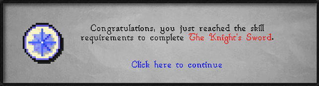

# Level Up Quest Requirements

This plugin will notify you when you gain a level which is the last skill requirement needed for a quest.

The plugin follows the requirements as listed by Jagex in the quest guide, and does not take into account any boostable requirements, or hidden requirements for Iron accounts.

Currently, it does not support quests with a combat level or quest point requirement only.

## Planned Features
- Support for combat level/quest point requirement only quests.
- Achievement diary support.